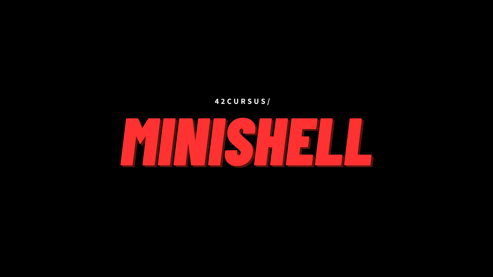

# Minishell

 
 

 

Welcome to Minishell, a simple Unix shell implementation created as a  project for 42 School. This project aims to replicate some basic  functionalities of a Unix shell, providing users with a minimalistic yet  functional command-line interface.

## About

 

Minishell is developed as part of the curriculum at 42 School, designed to enhance students' understanding of Unix systems and command-line interfaces. It offers a platform for users to execute basic commands, navigate through directories, and manage processes within a Unix-like environment.

## Features

 

* Command execution
* Built-in commands (e.g., `cd`, `echo`, `env`)
* Redirection of input and output
* Pipeline implementation
* Signal handling

## Contributing

This project is maintained by:
 

#### [LH4J](https://github.com/iTsLhaj)

#### [AYOUB](https://github.com/ayyoubgogo)

